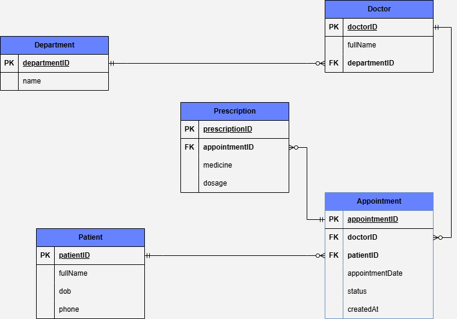

# Week 8 Assignment

This repository covers Week 8 Assignment:
 **Clinic Booking System** (MySQL)  

## 🔧 Prerequisites
- MySQL Server (v5.7+ recommended)
- MySQL Workbench


## 🏗️ Clinic Booking System
A structured relational database designed to manage all aspects of clinic Booking System.

### 🏥 Clinic Booking ERD
Below is the Entity-Relationship Diagram (ERD) for the **Clinic Booking** database:



Schema Overview
- department: List of medical departments.
- doctor: Doctors associated with departments.
- patient: Registered patients.
- appointment: Booking records linking patients to doctors.
- prescription: Medicines prescribed during appointments.

## 🚀 SetUp

1. Clone the repository: ```git clone https://github.com/Denis-Mwanzia/wk-8-assignment.git```
2. Open sql-scripts/setup.sql in MySQL Workbench and execute the script.
